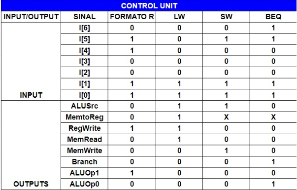

# Control Monocycle

A unidade de controle é crucial, ela ditará o funcionamento do processador como um todo através de sinais de controle, que serão explanadas melhor posteriormente.
O sinal de entrada da Unidade de Controle contém sete bits (Inputs), esses valores codificam as diversas saídas (Outputs). As operações executadas pelo processador dependem de cada módulo da Unidade de Controle, sendo os seguintes módulos:
**ALU Src: ** Indica que a fonte do dado da ALU deverá ser o immediate;
**Mem to Reg (Memória para Registrador):** Memory to Register, este sinal indica que um dado valor da memória de dados será lida e então, salva no Registrador.
**RegWrite:** É o enable para o Registrador, indicando que os registradores deverão estar prontos para salvarem a informação que virá.
**MemRead:** Sinal que liga a leitura das informações da Data Memory.
**Branch:** Ocorrerá a mudança no fluxo de dados, o branch só deve estar alto quando a operação de Branch if Equal (BEQ) estiver sendo realizada.
**AluOp1:** Funciona com o próximo sinal.
**AluOp0:** Juntamente com o sinal anterior, formam a ALUOP, esse sinal de dois bits será enviado para o ALU Control, que irá codificar a operação com um novo sinal e enviar para a ALU, indicando qual operação realizar.

A tabela a seguir deixa explícito cada um dos sinais que podem ser recebidos e enviados pela Unidade de Controle:

O circuito sintetizado pode ser vizualizado abaixo:

